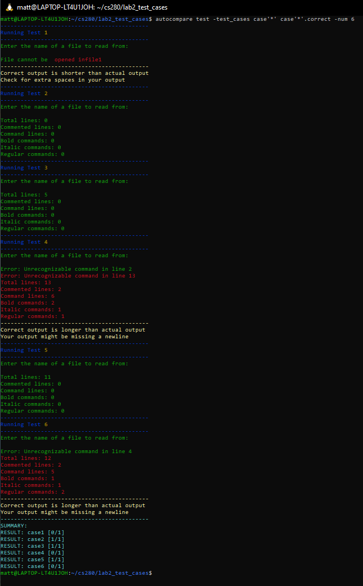

## Autocompare, Vocareum output debugging program

This program compares the output of a cpp program with the text provided in another file. Intended to aid in debugging vocareum test cases for matching output.

The first character that doesn't match the correct output will be highlighted in red along with all preceeding characters in that test.

**Usage: ./autocompare [your executable] -test_cases [input file] [output file] -num [(optional) number of test cases, default=1]**

**_NOTE:_ The input/output files can be specified with a '*' to denote the test case number.**

**_IMPORTANT:_ When typing the '*' for case number generic you need to use single or double quotation surrounding it. Ex: '\*' or "\*". **

### Examples
#### Building
```
./build.sh

sudo ./install.sh

or just build and move autocompare into your working directory

./build.sh

mv autocompare [working_directory]
```

#### Running
```
./autocompare lab.out -test_cases case'*' case'*'.correct -num 4

_This will run lab.out with the contents of case[1-4] and compare the program output with the content of case[1-4].correct_1
```

### Example Output

